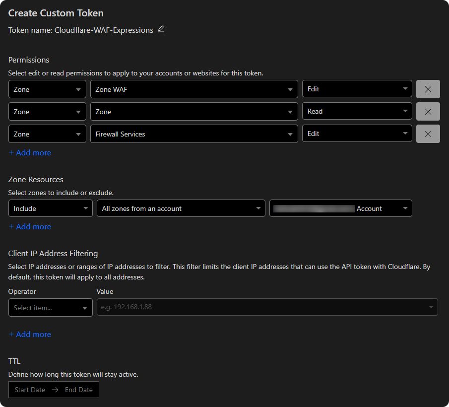

<div align="center">
    <h1>☁️ Cloudflare Web Application Firewall Rules</h1>
</div>

With these expressions for WAF, you can effectively block all unnecessary requests to your server, enhancing its security.
If you find this repository helpful, please consider giving it a star ⭐. Thank you!

 

> [!IMPORTANT]  
> It is also recommended to **disable** the `Bot Fight Mode` feature in the `Security` tab.  
> Although this feature helps detect and block automated bot traffic, it can inadvertently block safe, legitimate bots as well, which is not our intention.

> [!TIP]  
> Use a [dedicated script](#automatic-installation) to automatically update rules for each zone.


## 🛡️ What Can This List Block?
This list has been carefully crafted to enhance the security of your origin server by blocking a wide range of unnecessary and potentially malicious requests. Here is a summary of what it can block:

- **Sensitive Files and Directories:**
Blocks access to critical files and directories like `.git`, `.env`, and `.htaccess`, which often contain sensitive information that should remain private. It also prevents access to other commonly used configuration files and sensitive keys, such as SSH keys.

- **Common Attack Vectors:**
Blocks URLs with patterns commonly used in attacks, helping to prevent attempts to exploit known application vulnerabilities.

- **Backup Files:**
Blocks requests for backup files that could contain sensitive data.

- **Outdated Browsers:**
Blocks outdated browser versions often used by bots for automated attacks or unnecessary web crawling. It can also block DDoS attacks from botnets, which frequently use outdated user agents.

- **Unwanted Bots:**
Blocks various unwanted, unnecessary web crawlers and known malicious bots. This helps reduce unwanted bot traffic and alleviate server resource strain.

- **Specific IP Addresses and ASNs:**
Blocks traffic from known malicious IP addresses and ASNs to prevent attacks from flagged sources. The list also includes IP addresses associated with botnets.

<div align="center">
   <h3>>> <a href="markdown/expressions.md">View Main Expressions</a> <<</h3>
   <h3>>> <a href="markdown/cache.md">View Expressions for Caching</a> <<</h3>
</div>


## 📝 How to Use These Expressions
### Automatic (Recommended)<div id="automatic-installation"></div>
You can use the JavaScript code from this repository to automatically update the rules throughout the day.
There's no need to add them manually - the script takes care of everything.

#### Requirements
1. [Node.js + npm](https://nodejs.org/en)
2. [PM2](https://www.npmjs.com/package/pm2)
3. [Git](https://git-scm.com/downloads)

#### How to Use It
1. Clone this repository:
   ```bash
   git clone https://github.com/sefinek/Cloudflare-WAF-Expressions.git
   ```
2. Install the necessary dependencies:
   ```bash
   cd Cloudflare-WAF-Expressions && npm i
   ```
3. Copy the `.env.default` file and rename it to `.env`:
   ```bash
   cp .env.default .env
   ```
4. Open the `.env` file and ensure `NODE_ENV` is set to `production`. Paste your Cloudflare token in place of `CF_API_TOKEN`.<br><br>
   
5. Run the script 24/7 using PM2:
   ```bash
   pm2 start && pm2 save
   ```

### Manually
1. Log in to your [Cloudflare](https://dash.cloudflare.com) account.
2. Select the domain where you want to add the expressions.
3. Click on the `Security` tab, then choose `WAF` from the dropdown menu.
4. In the `Custom rules` tab, click the `Create rule` button.
5. Copy the expressions from the [markdown/expressions.md](markdown/expressions) file.
6. Click `Edit expression` and paste the copied expressions.
7. Click `Deploy` to save the changes. Repeat this process for the remaining parts of the expressions, ensuring you select the appropriate action (Block or Managed Challenge) as specified in the file.
8. Done! The expressions are now active and will start blocking unwanted traffic to your origin server. Check that your website functions correctly, and visit this repository periodically for the latest updates.


## 🔥 DDoS Mitigation (Highly Recommended)
Enabling DDoS protection in the `Security` tab is also recommended. Navigate to `DDoS` and click `Deploy a DDoS override`.

### Configuration
1. **Override name:** DDoS L7 ruleset
2. **Ruleset action:** Block
3. **Ruleset sensitivity:** Default


## 🤔 Help
If you have any questions or need help with the expressions, feel free to open an [Issue](https://github.com/sefinek/Cloudflare-WAF-Expressions/issues). I'll be happy to assist you.


## 🤝 Pull requests
If you have any suggestions or improvements, feel free to open a [Pull request](https://github.com/sefinek/Cloudflare-WAF-Expressions/pulls). Your contributions are highly appreciated and will help keep this list up-to-date and effective against the latest threats.


## 🔖 License
This project is licensed under the [MIT License](LICENSE).