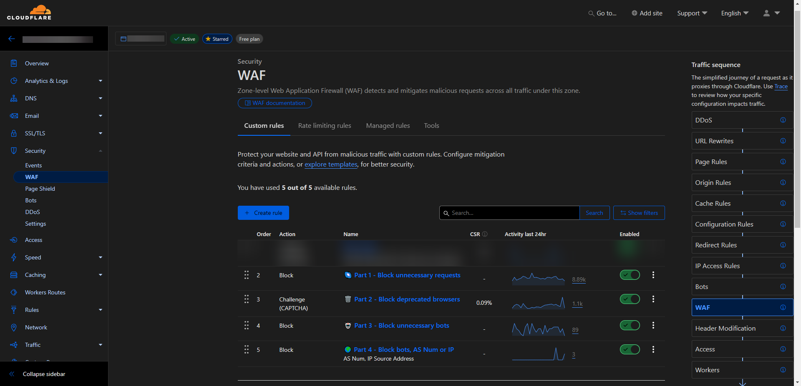

    <h1>☁️ Cloudflare Web Application Expressions</h1>

With these expressions (for WAF), you can effectively block all unnecessary requests to your server, enhancing its security and performance.

> [!IMPORTANT]  
> Additionally, it is recommended to **disable** the `Bot Fight Mode` feature located in the `Security tab`.
> This feature is designed to detect and block automated traffic from bots. However, it often blocks safe bots as well, which is not our intention.

## ⚠️ Warning
Please note that these expressions should not be used if you are utilizing WordPress or any similar content management system (CMS), as they may interfere with its normal functioning.
They are **highly recommended for Node.js applications** built on frameworks like Express, for example.

Make sure to check back here periodically. These lists are updated quite frequently to ensure they stay current and effective against the latest threats.

   <h3>>> <a href="expressions/main.md">View Expressions.md (for Node.js servers)</a> <<</h3>
    
   <h3>⭐ » Star the repo if you found it useful « ⭐</h3>

## 🛡️ What can this list block?
This list is carefully designed to block a wide range of unnecessary and potentially harmful requests to your origin server, enhancing its security. Here’s an overview of what it can block:

1. **Sensitive files and directories:**
   - Prevents access to critical files and directories, such as `.git`, `.env`, `.htaccess`, which often contain sensitive information that should never be publicly accessible. It also blocks access to other commonly used configuration files and keys, such as SSH keys and similar items.

2. **Common attack vectors:**
   - Blocks URLs containing patterns often used in attacks, helping to thwart attempts to exploit known application vulnerabilities.

3. **Backup files:**
   - Protects against requests for access to backup files that could contain sensitive data. This includes common backup file extensions and patterns.

4. **Outdated browsers:**
   - Identifies and blocks outdated browser versions that are often used by bots for automated attacks or unnecessary web crawling. Additionally, it can block DDoS attacks from botnets, which commonly use outdated user agents.

5. **Unwanted bots:**
   - Blocks various unwanted, unnecessary web crawlers and known malicious bots by analyzing specific user-agent strings. This helps reduce unwanted bot traffic and alleviate server resource strain.

6. **Specific IP addresses and ASNs:**
   - Blocks traffic from known malicious IP addresses and ASNs, helping to prevent attacks from sources flagged as malicious. The list also includes some IP addresses associated with botnets.

By implementing these blocks, you can significantly enhance the security of your Node.js applications while reducing the server load caused by unwanted traffic.

## ❌ What will this list never block?
1. Known and safe search engine indexing bots such as `Google`, `Bing`, `DuckDuckGo`, `Yandex`, `Yahoo!`, and others.
2. Outgoing requests from [Node.js](https://nodejs.org) applications using libraries like `node-fetch`, `axios`, `superagent`, `request`, and similar.
3. Outgoing requests from tools like `curl`, `wget`, `Postman`, `httpie`, `Insomnia`, and similar.
4. Legitimate traffic from commonly used APIs and services that are essential for the proper functioning of your application.
5. Webhooks and callbacks from trusted third-party services, ensuring seamless integration and communication.
6. Requests from popular cloud service providers like `AWS`, `Google Cloud`, `Azure`, and similar, which are often used in modern application architectures.
7. Requests for standard web files such as robots.txt, `ads.txt`, `sitemap.xml`, `humans.txt`, and similar, which are essential for proper web indexing and advertising management.

## 📝 How to use these expressions?
1. Log in to your [Cloudflare](https://dash.cloudflare.com) account.
2. Select the domain where you want to add the expressions.
3. Click on the `Security` tab and choose `WAF` from the dropdown list.
4. In the `Custom rules` tab, click the `Create rule` button.
5. Copy the expressions from the [expressions/main.md](expressions/main.md) file.
6. Click `Edit expression` and paste the copied expressions.
7. Click the `Deploy` button to save the changes. Repeat the same process for the remaining parts of the expressions. Remember to select the appropriate Action from the file (Block or Interactive Challenge).
8. Done! The expressions are now active and will start blocking unwanted traffic to your origin server. Make sure to check if your website functions correctly. Visit this repository periodically to use the latest lists.

## 🤔 Help
If you have any questions or need help with the expressions, feel free to open an [Issue](https://github.com/sefinek24/cloudflare-waf-expressions/issues). I will be happy to assist you.

## 🤝 Pull requests
If you have any suggestions or improvements, feel free to open a [Pull request](https://github.com/sefinek24/cloudflare-waf-expressions/pulls). Your contributions are highly appreciated and will help keep this list up-to-date and effective against the latest threats.

## ❤️ Star the repo
If you found this repository useful, please consider giving it a **star** ⭐. Thank you!

## 🔖 License
This project is licensed under the [MIT License](LICENSE).

[//]: # (<h3>>> <a href="expressions/php">View Expressions.md &#40;servers with PHP installed&#41;</a> <<</h3>)