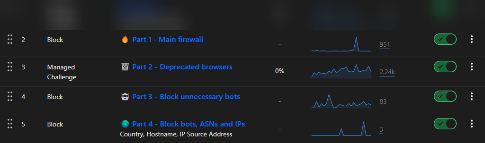

<div align="center">
    <h1>☁️ Cloudflare Web Application Firewall Rules</h1>
</div>

By using these WAF expressions, you can effectively block all unnecessary and potentially malicious requests targeting your origin server, thereby enhancing its security.
If you find this repository useful, I would greatly appreciate it if you could give it a **star** ⭐. Thank you!

> [!TIP]  
> Use a [dedicated script](#automatic-installation) to automatically update rules for each zone.  
> Join my [Discord server](https://discord.gg/53DBjTuzgZ) if you need help or want to receive notifications about important updates.

 


## 🛡️ What Can This List Block?
| **Type**                        | **Brief Description**                                                                                                                                                                                                     |
|---------------------------------|---------------------------------------------------------------------------------------------------------------------------------------------------------------------------------------------------------------------------|
| **Sensitive Files and Folders** | Access to critical files and directories, such as `.git`, `.env`, and `.htaccess`, which often contain sensitive information requiring protection. Also prevents access to other configuration files and keys, e.g., SSH. |
| **Common Attack Vectors**       | URLs with patterns commonly used in attacks.                                                                                                                                                                              |
| **Backup Files**                | Requests for backup files that may contain sensitive data.                                                                                                                                                                |
| **Outdated Browsers**           | Versions of browsers, often used by bots for automated attacks (DDoS attacks from botnets, which frequently utilize outdated user agents) or unnecessary website indexing.                                                |
| **Useless Bots**                | Various unwanted and unnecessary web crawlers as well as known malicious bots. Blocking them can reduce server load.                                                                                                      |
| **Specific IP Addresses & ASN** | Traffic from known malicious IP addresses and ASNs. The list also includes IP addresses associated with botnets.                                                                                                          |

> [!IMPORTANT]  
> It is also recommended to **disable** the `Bot Fight Mode` feature in the `Security` tab.  
> Although this feature helps detect and block automated bot traffic, it can inadvertently block safe, legitimate bots as well, which is not our intention.

<div align="center">
   <h3>>> <a href="markdown/expressions.md">View Main Expressions</a> <<</h3>
   <h3>>> <a href="markdown/cache.md">View Expressions for Caching</a> <<</h3>
</div>


## 📝 How to Use?
### Automatic (Recommended)<div id="automatic-installation"></div>
You can use the JavaScript code from this repository to automatically update the rules throughout the day.  
There's no need to add them manually because the script takes care of everything for you (:

#### Requirements
1. [Node.js LTS + npm](https://nodejs.org)
2. [PM2](https://www.npmjs.com/package/pm2) (`npm i pm2 -g`)
3. [Git](https://git-scm.com/downloads)
4. Linux (recommended) or Windows

#### Tutorial (for Linux)
1. Clone this repository:
   ```bash
   git clone https://github.com/sefinek/Cloudflare-WAF-Expressions.git
   ```
2. Install the necessary dependencies:
   ```bash
   cd Cloudflare-WAF-Expressions && npm install
   ```
3. Copy the `.env.default` file and rename it to `.env`:
   ```bash
   cp .env.default .env
   ```
4. Open the `.env` file and ensure `NODE_ENV` is set to `production`. Paste your Cloudflare token in place of `CF_API_TOKEN`.
   ```bash
   mcedit .env
   ```
   
5. Run the script 24/7 using PM2:
   ```bash
   pm2 start && pm2 save
   ```
6. Add PM2 to autostart:
   ```bash
   pm2 startup
   Then execute the generated command from the output.
   ```
   
### Manually
1. Log in to your [Cloudflare](https://dash.cloudflare.com) account.
2. Select the domain where you want to add the expressions.
3. Click on the `Security` tab, then choose `WAF` from the dropdown menu.
4. In the `Custom rules` tab, click the `Create rule` button.
5. Copy the expressions from the [markdown/expressions.md](markdown/expressions.md) file.
6. Click `Edit expression` and paste the copied expressions.
7. Click `Deploy` to save the changes. Repeat this process for the remaining parts of the expressions, ensuring you select the appropriate action (Block or Managed Challenge) as specified in the file.
8. Done! The expressions are now active and will start blocking unwanted traffic to your origin server. Check that your website functions correctly, and visit this repository periodically for the latest updates.


## 🔥 DDoS Mitigation (Highly Recommended)
Enabling DDoS protection in the `Security` tab is also recommended. Navigate to `DDoS` and click `Deploy a DDoS override`.

### Configuration
1. **Override name:** DDoS L7 ruleset
2. **Ruleset action:** Block
3. **Ruleset sensitivity:** Default


## 🤝 Pull requests
If you have any suggestions or improvements, feel free to open a [Pull request](https://github.com/sefinek/Cloudflare-WAF-Expressions/pulls).
Your contribution will be appreciated and will help keep this list up-to-date and effective in combating the latest threats. Thank you!


## 🔖 License
This project is licensed under the [MIT License](LICENSE).